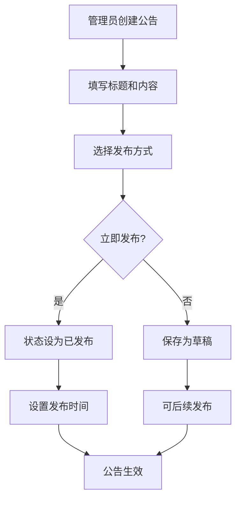
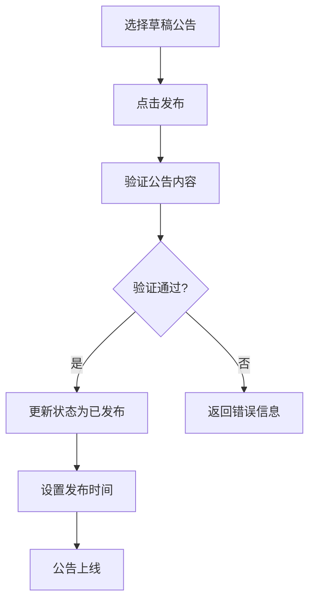
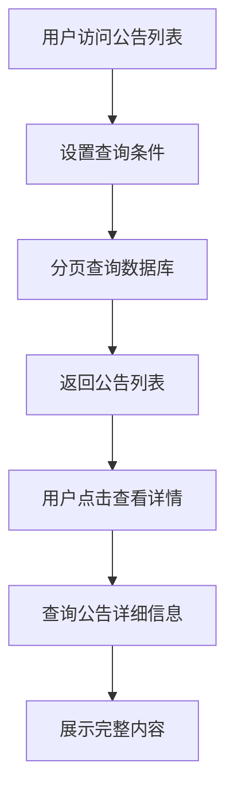

# 公告管理功能个人纪要

## 2025年6月1日 会议纪要

### 鉴权方式

jwt

### 分页方式

基于游标和基于页号的
走base list

### token预置

还没留呢

## 通知统一用rpc

## 筛选项

### 置顶

sticky字段单开还是塞attribute里头？
如果塞attributes里头我要去研究

好了直接新开一个字段吧

- [x] 公告类型（改一下integrate）
- [x] createUid和updateUid记得改jwt（AntoFillHandler），目前Mock值还留着
- [x] 调用BaseEntity
- [x] 调用BaseList
- [x] 分接口管理（管理员和用户端）
- [x] Respond的枚举管理（status和type）
- [x] 接口命名
- [x] 返回相应里面显示creator_name和updator_name（目前先拿字符填上）
- [x] 完成MyBatis-Plus迁移
- [x] 实现Edit
- [x] 实现Sticky
- [x] 实现Delete接口
- [x] GETList（用户）
- [X] GETDetail（管理员）
- [x] SaToken 鉴权（update还没测）
- [x] caffeine ID - Username
- [x] GETList（管理员）
- [x] 复用TinyRespond
- [x] 定时发布+条件筛选的混合确定（2025年7月2日 一半吧，管理端可能看着还是有问题，因此保留了1小时一次的轮询）
- [x] 重写错误处理逻辑
- [ ] 标题和内容防SQL、防止XSS攻击
- [ ] 按标题模糊检索
- [ ] 全部公告混合排列
- [ ] 大的UnitTest
- [ ] Alibaba lint

```mermaid
graph TD
    A[Controller] -->|传递DTO| B(Service层)
    B -->|转换DTO->Entity| C[Manager层]
    C -->|操作Entity| D[Repository]


```mermaid
sequenceDiagram
    participant C as Controller
    participant S as Service
    participant M as Manager
    participant R as Repository

    C->>S: createAnnouncement(requestDTO)
    S->>S: convert requestDTO → entity
    S->>M: createAnnouncement(entity)
    M->>R: save(entity)
    R-->>M: savedEntity
    M-->>S: savedEntity
    S->>S: build responseDTO
    S-->>C: responseDTO
```

## 1. 功能概述

公告管理功能为论坛系统提供公告的创建、发布、查询等核心能力，支持管理员发布重要通知和系统公告。

### 1.1 核心功能

- **创建公告**：管理员可以创建公告草稿
- **发布公告**：将草稿状态的公告发布上线
- **查询公告列表**：支持分页查询和状态筛选
- **查询公告详情**：获取单个公告的完整信息

### 1.2 业务价值

- 提供官方信息发布渠道
- 支持重要通知的及时传达
- 提供灵活的公告管理能力

## 2. 数据库设计

### 2.1 公告表结构 (announcement)

```sql
create table announcement (
    id int not null comment '公告ID' primary key,
    title varchar(100) not null comment '公告标题',
    content text not null comment '正文',
    -- target_id int null comment '目标用户ID（为空则全体用户）',
    type varchar(20) not null comment '公告类型（系统公告、学校公告）',
    sender varchar(10) not null comment '发送人署名',
    created_at timestamp default CURRENT_TIMESTAMP not null comment '发布时间',
    updated_at timestamp not null on update CURRENT_TIMESTAMP comment '更新时间',
    scheduled_publish_time timestamp null comment '预定发布时间',
    status int not null comment '状态（0草稿、1已发布、2待发布、3已删除）',
    createUid int not null comment '创建用户',
    updateUid int not null comment '更新用户',
    deleted boolean not null comment '是否被删除',
    attribute text null comment '属性列（json string，包含stick等扩展属性）',
);
```

主要修改：

- 移除了 target_id 字段
- 移除了 sender 字段
- create_uid和update_uid重命名为createUid和updateUid

### 2.2 数据库内字段说明

| 字段名                 | 类型         | 说明         | 备注                                 |
| ---------------------- | ------------ | ------------ | ------------------------------------ |
| id                     | bigint       | 主键ID       | 自增                                 |
| title                  | varchar(100) | 公告标题     | 必填，最大50字符                    |
| content                | text         | 公告内容     | 必填，支持富文本，最多500字符        |
| type                   | varchar(20)  | 公告类型     | 必填，系统公告、学校公告             |
| created_at             | timestamp    | 创建时间     | 自动填充，创建公告时记录当前时间     |
| updated_at             | timestamp    | 更新时间     | 自动填充，更新公告时记录当前时间     |
| scheduled_at           | timestamp    | 预定发布时间 | 可选，为空则立即发布               |
| status                 | int          | 状态         | 必填，0草稿、1已发布、2待发布 |
| createUid             | bigint       | 创建用户ID   | 必填，创建公告的用户ID              |
| updateUid             | bigint       | 更新用户ID   | 必填，更新公告的用户ID              |
| deleted                | boolean      | 是否被删除   | 必填，true表示被删除，false表示未删除 |
| attribute              | text         | 属性列       | 可选，json string，包含stick等扩展属性 |

## 3. API接口设计

### 3.1 接口概览

| 功能         | 方法 | 路径                       | 描述               |
| ------------ | ---- | -------------------------- | ------------------ |
| 创建公告     | POST | /announcement/create | 创建草稿状态的公告 |
| 发布公告     | PUT  | /announcement/publish/{id} | 发布指定公告       |
| 查询公告列表 | GET  | /announcement/list         | 分页查询公告列表   |
| 查询公告详情 | GET  | /announcement/detail/{id}  | 获取公告详细信息   |
| 删除公告     | DELETE | /announcement/delete/{id} | 删除指定公告       |

### 3.2 接口详细设计

#### 3.2.1 创建公告

**请求信息**

```
POST /announcement/create
Content-Type: application/json
```

**请求参数**

```json
{
  "title": "公告标题", // 必填，公告标题，输入
  "content": "公告内容", // 必填，公告内容，输入
  "type": "系统公告", // 必填，公告类型，输入
  "scheduled_at": "2026-01-01 09:00:00", // 公告发布时间，可空，不得晚于当前时间
  "status": 0, // 必填，发布时间如果不填为0或者1，否则为2
  "attribute":null // 选填，附加属性
}
```

**响应示例**

```json
{
  "code": 200,
  "message": "创建成功",
  "data": {
    "id": 1,
    "title": "公告标题",
    "content": "公告内容",
    "type": "系统公告",
    "sender": "管理员",
    "created_at": "2024-01-01 09:00:00",
    "updated_at": "2024-01-01 09:00:00",
    "scheduled_publish_time": null,
    "status": 1,
    "createUid": 123,
    "updateUid": 123,
    "deleted": false,
    "attribute": "sticky:1"
  }
}
```

<!-- #### 3.2.2 发布公告

**请求信息**

```
PUT /announcement/publish/{id}
```

**路径参数**

- id: 公告ID

**响应示例**

```json
{
  "code": 200,
  "message": "发布成功",
  "data": {
    "id": 1,
    "title": "公告标题",
    "content": "公告内容",
    "status": 1,
    "createUid": 123,
    "creatorName": "管理员",
    "createTime": "2024-01-01 09:00:00",
    "updateTime": "2024-01-01 10:00:00",
    "publishTime": "2024-01-01 10:00:00",
    "scheduledPublishTime": "2024-01-01 10:00:00"
  }
}
``` -->

#### 3.2.3 查询公告列表

**请求信息**

```
GET /announcement/list?page=1&size=10&status=1
```

**请求参数**

| 参数名 | 类型 | 必填 | 说明                   |
| ------ | ---- | ---- | ---------------------- |
| page   | int  | 否   | 页码，默认1            |
| size   | int  | 否   | 每页大小，默认10       |
| status | int  | 否   | 状态筛选，不传查询所有 |

**响应示例**

```json
{
  "code": 200,
  "message": "查询成功",
  "data": {
    "total": 100,
    "page": 1,
    "size": 10,
    "pages": 10,
    "list": [
      {
        "id": 1,
        "title": "公告标题",
        "content": "公告内容摘要...",
        "status": 1,
        "createUid": 123,
        "creatorName": "管理员",
        "createTime": "2024-01-01 09:00:00",
        "updateTime": "2024-01-01 10:00:00",
        "publishTime": "2024-01-01 10:00:00"
      }
    ]
  }
}
```

#### 3.2.4 查询公告详情

**请求信息**

```
GET /announcement/detail/{id}
```

**路径参数**

- id: 公告ID

**响应示例**

```json
{
  "code": 200,
  "message": "查询成功",
  "data": {
    "id": 1,
    "title": "公告标题",
    "content": "公告完整内容...",
    "status": 1,
    "createUid": 123,
    "creatorName": "管理员",
    "createTime": "2024-01-01 09:00:00",
    "updateTime": "2024-01-01 10:00:00",
    "publishTime": "2024-01-01 10:00:00",
    "scheduledPublishTime": "2024-01-01 10:00:00"
  }
}
```

## 4. 业务流程设计

### 4.1 公告创建流程



### 4.2 公告发布流程



### 4.3 公告查询流程



## 5. 技术实现方案

### 5.1 技术架构

```
┌─────────────────┐
│   Controller    │  ← REST API接口层
├─────────────────┤
│    Service      │  ← 业务逻辑层
├─────────────────┤
│    Manager      │  ← 业务管理层
├─────────────────┤
│    Mapper       │  ← 数据访问层
├─────────────────┤
│    Database     │  ← 数据存储层
└─────────────────┘
```

----

PS. 一下部分为AI画饼，还没和实际代码对照过，看看即可
--

### 5.2 核心类设计

#### 5.2.1 实体类 (AnnouncementDO)

```java
@Data
@TableName("announcement")
public class AnnouncementDO {
    @TableId(type = IdType.AUTO)
    private Long id;
    private String title;
    private String content;
    private Integer status;
    private Long createUid;
    private String creatorName;
    private LocalDateTime createTime;
    private LocalDateTime updateTime;
    private LocalDateTime publishTime;
    private LocalDateTime scheduledPublishTime;
}
```

#### 5.2.2 请求DTO

```java
@Data
public class CreateAnnouncementRequest {
    @NotBlank(message = "标题不能为空")
    @Length(max = 200, message = "标题长度不能超过200字符")
    private String title;

    @NotBlank(message = "内容不能为空")
    private String content;

    @NotNull(message = "创建者ID不能为空")
    private Long createUid;

    @NotBlank(message = "创建者姓名不能为空")
    private String creatorName;

    private LocalDateTime scheduledPublishTime;
}
```

#### 5.2.3 响应DTO

```java
@Data
public class AnnouncementResponse {
    private Long id;
    private String title;
    private String content;
    private Integer status;
    private String statusName;
    private Long createUid;
    private String creatorName;
    private LocalDateTime createTime;
    private LocalDateTime updateTime;
    private LocalDateTime publishTime;
    private LocalDateTime scheduledPublishTime;
}
```

### 5.3 关键业务逻辑

#### 5.3.1 状态管理

- **草稿状态(0)**：新创建的公告，可以编辑和发布
- **已发布状态(1)**：正式发布的公告，用户可见
- **已下线状态(2)**：已下线的公告，用户不可见

#### 5.3.2 发布逻辑

```java
public void publishAnnouncement(Long id) {
    // 1. 查询公告
    AnnouncementDO announcement = getById(id);

    // 2. 验证状态
    if (announcement.getStatus() != 0) {
        throw new BusinessException("只能发布草稿状态的公告");
    }

    // 3. 更新状态和发布时间
    announcement.setStatus(1);
    announcement.setPublishTime(LocalDateTime.now());

    // 4. 保存更新
    updateById(announcement);
}
```

#### 5.3.3 分页查询

```java
public PageResult<AnnouncementResponse> listAnnouncements(
    Integer page, Integer size, Integer status) {

    // 1. 构建查询条件
    LambdaQueryWrapper<AnnouncementDO> wrapper = new LambdaQueryWrapper<>();
    if (status != null) {
        wrapper.eq(AnnouncementDO::getStatus, status);
    }
    wrapper.orderByDesc(AnnouncementDO::getCreateTime);

    // 2. 分页查询
    Page<AnnouncementDO> pageParam = new Page<>(page, size);
    Page<AnnouncementDO> result = page(pageParam, wrapper);

    // 3. 转换响应
    return convertToPageResult(result);
}
```

## 6. 异常处理

### 6.1 业务异常

- **公告不存在**：查询不到指定ID的公告
- **状态错误**：尝试发布非草稿状态的公告
- **参数校验失败**：标题或内容为空、长度超限等

### 6.2 异常响应格式

```json
{
  "code": ERRORCODE,
  "message": "业务异常信息",
  "data": null
}
```

## 7. 性能优化

### 7.1 数据库优化

- 在status、createUid、created_at、updated_at、scheduled_at字段上建立索引
- 对于列表查询，只返回必要字段，避免查询大文本内容
- 使用分页查询，避免一次性加载大量数据

### 7.2 缓存策略

- 对热门公告进行Redis缓存
- 公告列表数据缓存，设置合理的过期时间
- 发布/更新公告时清除相关缓存

## 8. 安全考虑

### 8.1 权限控制

- 只有管理员角色可以创建和发布公告
- 接口需要进行身份认证和权限校验

### 8.2 数据校验

- 对输入参数进行严格校验
- 防止XSS攻击，对公告内容进行安全过滤
- 限制公告标题和内容的长度

## 9. 测试方案

### 9.1 单元测试

- Service层业务逻辑测试
- Manager层数据处理测试
- Mapper层数据访问测试

### 9.2 集成测试

- API接口功能测试
- 数据库事务测试
- 异常场景测试

### 9.3 测试用例

```java
@Test
public void testCreateAnnouncement() {
    // 测试创建公告功能
}

@Test
public void testPublishAnnouncement() {
    // 测试发布公告功能
}

@Test
public void testListAnnouncements() {
    // 测试查询公告列表功能
}

@Test
public void testGetAnnouncementDetail() {
    // 测试查询公告详情功能
}
```

## 10. 部署说明

### 10.1 环境要求

- JDK 8+
- MySQL 5.7+
- Redis 3.0+

### 10.2 配置项

```yaml
# 公告相关配置
announcement:
  # 每页默认大小
  default-page-size: 10
  # 最大每页大小
  max-page-size: 100
  # 标题最大长度
  max-title-length: 200
```

## 11. 监控告警

### 11.1 关键指标

- 公告创建成功率
- 公告发布成功率
- 接口响应时间
- 数据库查询性能

### 11.2 告警规则

- 接口错误率超过5%时告警
- 接口响应时间超过2秒时告警
- 数据库连接异常时告警

---

## 一、公告系统相关代码结构分析

根据项目目录结构和模块划分，公告系统的相关代码主要集中在以下几个部分：

### 1. `forum-api` 模块

- **AnnouncementService.proto**：定义了基于 Protobuf 的公告服务接口。
  - 包含的接口：
    - 获取公告列表（List）
    - 获取单个公告详情（Get）
    - 创建公告（Create）
    - 更新公告（Update）
    - 删除公告（Delete）

### 2. `forum-service` 模块

- **service/AnnouncementService.java**：公告服务接口的实现类。
  - 主要功能包括：
    - 查询公告列表
    - 获取公告详情
    - 创建、更新、删除公告
    - 分页支持
- **manager/AnnouncementManager.java**：负责公告数据的原子操作，如数据库增删改查。
- **mapper/AnnouncementMapper.java**：MyBatis Plus 的 Mapper 接口，用于与数据库交互。

### 3. `forum-start` 模块

- **controller/AnnouncementController.java**：处理 HTTP 请求，调用 Service 层并返回响应。
  - 提供 RESTful API 接口，例如：
    - `/api/announcement/list`
    - `/api/announcement/{id}`
    - `/api/announcement/create`
    - `/api/announcement/update`
    - `/api/announcement/delete`

---

## 二、优化建议

### 1. 分页查询性能优化

**当前问题**：

- 如果公告数量较多，直接使用默认的 MyBatis Plus 分页插件可能会导致性能下降，尤其是在大数据量的情况下。

**优化方案**：

- 使用 **物理分页 + 缓存机制**：
  - 对于频繁访问的公告列表（如首页公告），可以将第一页的数据缓存到 Redis 中，减少数据库压力。
  - 使用 MyBatis Plus 的 `Page` 类进行分页时，确保索引字段（如 `create_time`）有合适的数据库索引，提升查询效率。

**理由**：

- 减少数据库 I/O 操作，提升响应速度。
- 避免在高并发场景下出现数据库瓶颈。

---

#### 2. 公告内容缓存

**当前问题**：

- 公告通常为静态或低频更新的内容，频繁读取数据库会导致不必要的资源消耗。

**优化方案**：

- 引入 **Redis 缓存**：
  - 将公告详情（如通过 ID 查询）缓存至 Redis，设置合理的过期时间（如 5 分钟）。
  - 在创建、更新或删除公告时，主动清除对应缓存，保证数据一致性。

**理由**：

- 显著降低数据库负载，提高访问速度。
- 特别适用于公告详情页面的高频访问场景。

---

#### 3. 权限控制细化

**当前问题**：

- 公告的 CRUD 操作可能没有严格的权限隔离，普通用户和管理员可能存在越权访问风险。

**优化方案**：

- 使用 Sa-Token 的 **RBAC 权限模型**：
  - 定义不同角色（如普通用户、管理员）对公告的访问权限。
  - 在 Controller 层添加注解（如 `@SaCheckPermission("announcement:read")`）进行细粒度权限控制。
- 对敏感操作（如删除）增加二次确认机制或日志记录。

**理由**：

- 提高系统安全性，防止越权操作。
- 符合最小权限原则，增强系统的健壮性。

---

### 4. 公告搜索与筛选功能

当前问题：

- 目前公告查询接口较为简单，缺乏按标题、作者、时间范围等条件筛选的功能。

**优化方案**

- 扩展公告查询接口：
  - 支持按标题模糊搜索、按作者、按时间段筛选等功能。
  - 使用 MyBatis Plus 的 `QueryWrapper` 构建动态查询条件。
- 在前端展示时提供筛选控件，提升用户体验。

**理由**

- 提升公告管理的灵活性与可用性。
- 更好地满足运营人员对公告数据的统计与分析需求。

---

### 5. **异步日志记录**

**当前问题**

- 公告的创建、更新、删除等操作未见详细的日志记录，不利于后续审计。

**优化方案**

- 使用 Spring AOP 或自定义注解实现 **异步日志记录**：
  - 记录操作人、操作时间、操作类型、受影响的公告 ID 等信息。
  - 日志写入异步队列（如 RabbitMQ 或 Kafka），避免阻塞主线程。

**理由**

- 提高系统的可观测性和可维护性。
- 有助于追踪异常操作，保障数据安全。

---

### 总结

| 优化方向           | 描述                                   | 技术实现建议                     |
|--------------------|----------------------------------------|----------------------------------|
| 分页查询优化       | 提升大数据量下的查询效率               | MyBatis Plus + Redis 缓存        |
| 公告缓存           | 减少数据库访问频率                     | Redis 缓存 + 过期策略            |
| ~~发布状态管理~~   | 支持定时发布与延迟生效               | 状态字段 + 定时任务              |
| ~~版本控制~~     | 支持公告历史版本记录                 | 历史表 + AOP 自动记录            |
| 权限控制           | 防止越权访问                         | Sa-Token RBAC + 注解权限控制     |
| 搜索与筛选         | 提升公告管理灵活性                   | 动态查询 + QueryWrapper          |
| 异步日志记录       | 提高系统可观测性                     | AOP + 异步日志队列                |

以上优化建议旨在提升公告系统的性能、安全性、可维护性及用户体验。下一步可根据实际业务需求选择优先级较高的优化点进行实施
---

**文档版本**: v1.0  
**创建时间**: 2024-01-01  
**更新时间**: 2024-01-01  
**维护人员**: SituChengxiang（sk）  
